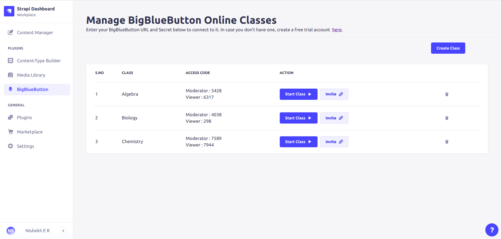
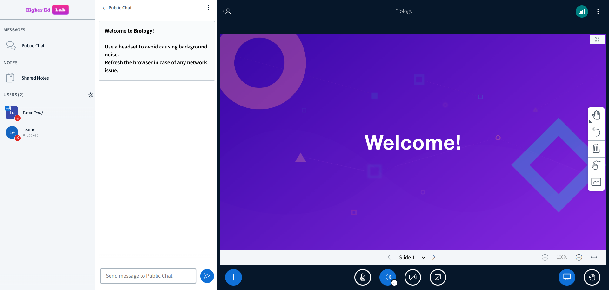
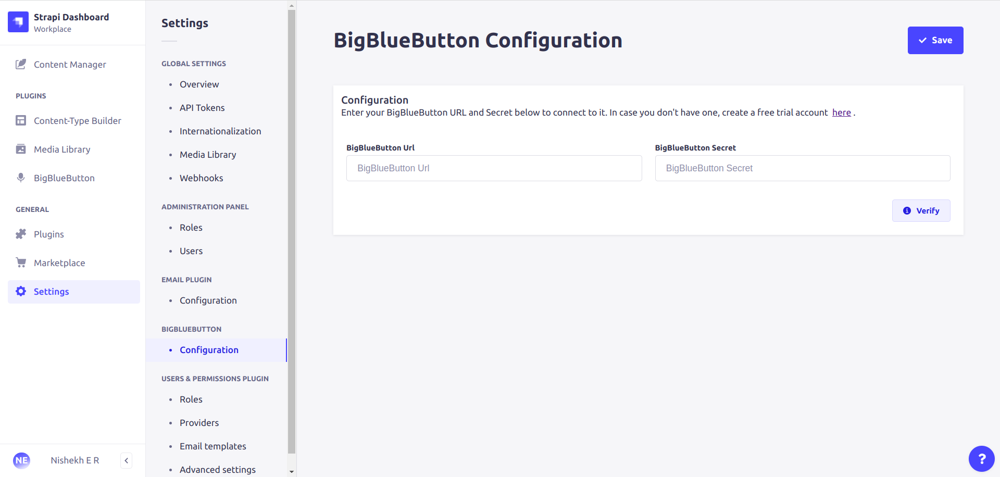

<div align="center" width="150px">
  
</div>
<div align="center">
  <h1>BigBlueButton-Strapi</h1>
  <p>Start Online Classes on BigBlueButton</p>
  <a href="https://www.npmjs.com/package/bigbluebutton-strapi">
    
  </a>
  <a href="https://www.npmjs.org/package/bigbluebutton-strapi">
    
  </a>
  
</div>

---

<div style="margin: 20px 0" align="center">
   <br/>
  
</div>

A plugin for [Strapi Headless CMS](https://github.com/strapi/strapi) that facilitate conducting online classes.

<br/><br/>

## ✨ Features

- **Create new classes**
- **Teachers can easily start classes**
- **Teachers can invite the students to join class**

<br/><br/>

## ⚙️ Versions

- **Strapi v4**

<br/><br/>

## 🖐 Requirements

Complete installation requirements are exact same as for Strapi itself and can be found in the documentation under [Installation Requirements](https://docs.strapi.io/developer-docs/latest/getting-started/introduction.html).

**Minimum environment requirements**

- Node.js `>=14.x.x`
- NPM `>=6.x.x`

In our minimum support we're following [official Node.js releases timelines](https://nodejs.org/en/about/releases/).

**Supported Strapi versions**:

- Strapi v4.1.2 (recently tested)
- Strapi v4.x

> This plugin is designed for **Strapi v4** and is not working with v3.x.
> **We recommend always using the latest version of Strapi to start your new projects**.

<br/><br/>

## ⏳ Installation

(Use **npm** to install this plugin within your Strapi project (recommended). [Install npm with these docs](https://docs.npmjs.com/cli/v6/commands/npm-install).)

```bash
npm i bigbluebutton-strapi
```

After successful installation you've to build a fresh package that includes plugin UI. To archive that simply use:

```bash
# with npm
$ npm run build
$ npm run develop

# with npx
$ npx strapi  build
$ npx strapi  develop
```

or just run Strapi in the development mode with `--watch-admin` option:

```bash
# with npm
npm develop --watch-admin

# with npx
npx strapi develop --watch-admin
```

The **BigBlueButton** plugin should appear in the **Plugins** section of Strapi sidebar after you run app again.

Enjoy 🎉

<br/><br/>

## 🔧 Configuration

In this Plugin introduce the intuitive **Settings** page which you can easly access via `Strapi Settings -> Section: BIGBLUEBUTTON -> Configuration`. On dedicated page you will be able to setup all crucial properties which drives the plugin.

<div style="margin: 20px 0" align="center">
  
</div>

- Enter BigBlueButton Url and Secret, if you don't have create free account [here](https://higheredlab.com/).
- Click on verify it will verify entered BigBlueButton Url and Secret correct or not.
- Click on Save.

To setup amend default plugin configuration we recommend to put following snippet as part of `config/plugins.js` file. If the file does not exist yet, you have to create it manually.

```js
module.exports = {
  // ...
  bigbluebutton: {
    enabled: true,
  },
  // ...
};
```

> _Note_
> Default configuration for your plugin is fetched from `config/plugins.js` or directly from the plugin itself.

<br/><br/>

## 📝 License

[MIT License](LICENSE.md) Copyright (c) [Asyncweb](https://higheredlab.com/).
